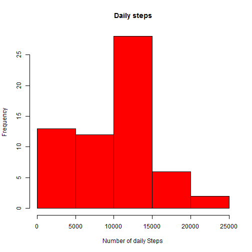
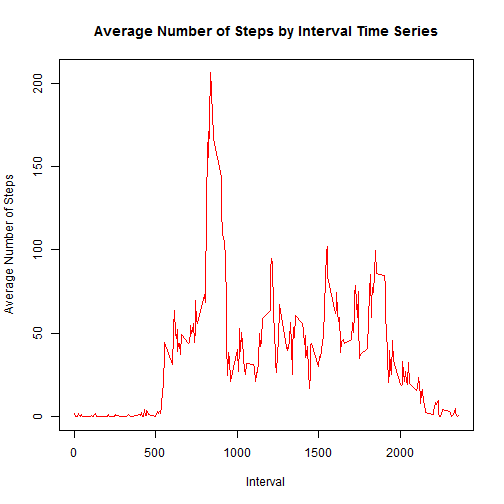
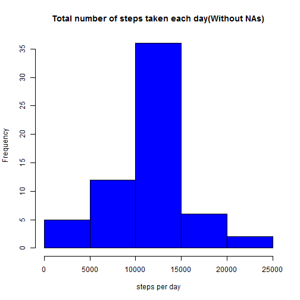
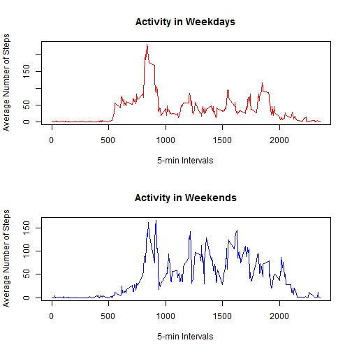
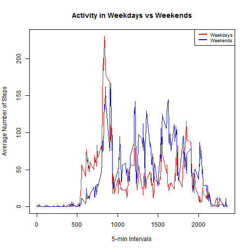

# Reproducible Research: Peer Assessment 1
## Author: Walter Muruet

## Loading and preprocessing the data

Required Libraries

```r
require(dplyr)
require(lubridate)
```

Download Required file(s)

```r
## Set URL
url<- "https://d396qusza40orc.cloudfront.net/repdata%2Fdata%2Factivity.zip"

## Download Files
if (!file.exists("activity.zip")){
  download.file (url, destfile= "activity.zip")
  downloaddate<- date()
}
```

Unzip

```r
## Unzip files
if(!file.exists("activity.csv")){
  unzip("activity.zip")
}
```

### 1.1 Load the Data


```r
 activity<- read.csv("activity.csv")
```

### 1.2 Process/transform the data (if necessary) into a format suitable for your analysis


```r
## Setting Values in column "date"", as dates
activity$date<- as.Date(activity$date)

## Grouping by Date
activity_date<- group_by(activity, date)
activity_interval<- group_by(activity, interval)
```

## What is mean total number of steps taken per day?

### 2.1 Calculate the total number of steps taken per day


```r
steps_day<-summarize(activity_date,Total_Steps= sum(steps, na.rm= TRUE))
steps_day
```

```
## Source: local data frame [61 x 2]
## 
##          date Total_Steps
## 1  2012-10-01           0
## 2  2012-10-02         126
## 3  2012-10-03       11352
## 4  2012-10-04       12116
## 5  2012-10-05       13294
## 6  2012-10-06       15420
## 7  2012-10-07       11015
## 8  2012-10-08           0
## 9  2012-10-09       12811
## 10 2012-10-10        9900
## ..        ...         ...
```
### 2.2.1 Difference between a histogram and a barplot

 a) Histogram: A graphical representation of the distrbution of data that displays the frequencies of a data set.

 b) Boxplot: A graphical representation of the five most important descriptive values for a data set:

  i minimum value 
  ii first quartille 
  iii the median 
  iV the third quartile 
  v the maximum value 

### 2.2.1 Make a histogram of the total number of steps taken each day


```r
hist(steps_day$Total_Steps, main= "Daily steps", xlab= "Number of daily Steps", col="red")
```

 

### 2.3 Calculate and report the mean and median of the total number of steps taken per day


```r
steps_day2<-summarize(activity,Total_Steps= sum(steps, na.rm= TRUE), Mean_Steps = mean(steps, na.rm= TRUE), Median_steps = median(steps, na.rm= TRUE))
print(steps_day2)
```

```
##   Total_Steps Mean_Steps Median_steps
## 1      570608    37.3826            0
```

## What is the average daily activity pattern?

### 3.1 Make a time series plot (i.e. type = "l") of the 5-minute interval (x-axis) and the average number of steps taken, averaged across all days (y-axis)


```r
avg_by_interval<- summarise(activity_interval, avg_steps_interval= mean(steps, na.rm=TRUE))
x<- avg_by_interval$interval
y<- avg_by_interval$avg_steps_interval
plot(x,y, "l", main="Average Number of Steps by Interval Time Series", xlab="Interval", ylab="Average Number of Steps", col="red")
```

 

### 3.2 Which 5-minute interval, on average across all the days in the dataset, contains the maximum number of steps?


```r
maxsteps_interval<- avg_by_interval[avg_by_interval$avg_steps_interval==max(avg_by_interval$avg_steps_interval),]
print (maxsteps_interval)
```

```
## Source: local data frame [1 x 2]
## 
##   interval avg_steps_interval
## 1      835           206.1698
```

## Inputing missing values

### 4.1 Calculate and report the total number of missing values in the dataset (i.e. the total number of rows with NAs)


```r
## Filter is used in case there are more than 1 NA per row 
missvals<- filter(activity, is.na(steps) | is.na(date)|is.na(interval))
number_NAs<-dim(missvals)[1]
print(number_NAs)
```

```
## [1] 2304
```

### 4.2 Devise a strategy for filling in all of the missing values in the dataset. The strategy does not need to be sophisticated. For example, you could use the mean/median for that day, or the mean for that 5-minute interval, etc.

Strategy choosen: Replace the NAs with the mean value for the corresponding 5-min interval. This values were obtained previously and 
stored in the variable avg_by_interval, from which they will be extracted.

```r
m<-dim(activity)[1]
activity_clean<-activity
for (i in 1:m){
        if(is.na(activity_clean[i,1])){
                searcher<- activity_clean[i,3]
                result<-avg_by_interval[avg_by_interval$interval==as.integer(searcher),2]
                activity_clean[i,1]<- result
        }
}
```

### 4.3 Create a new dataset that is equal to the original dataset but with the missing data filled in.


```r
head (activity_clean)
```

```
##       steps       date interval
## 1 1.7169811 2012-10-01        0
## 2 0.3396226 2012-10-01        5
## 3 0.1320755 2012-10-01       10
## 4 0.1509434 2012-10-01       15
## 5 0.0754717 2012-10-01       20
## 6 2.0943396 2012-10-01       25
```

```r
print (sum(is.na(activity_clean)))
```

```
## [1] 0
```

### 4.4 Make a histogram of the total number of steps taken each day.  

### 4.4.1 Process the clean data and make the histogram


```r
## Group data by Date
activity_clean_day<- group_by(activity_clean,date)
steps_day_clean<-summarize(activity_clean_day,Total_Steps= sum(steps, na.rm= TRUE))
## Create the Histogram
hist(steps_day_clean$Total_Steps, main= "Total number of steps taken each day(Without NAs)", xlab= "steps per day", col="Blue")
```

 

### 4.4.2 Calculate and report the mean and median total number of steps taken per day.


```r
steps_day2_clean<-summarize(activity_clean,Total_Steps= sum(steps, na.rm= TRUE), Mean_Steps = mean(steps, na.rm= TRUE), Median_steps = median(steps, na.rm= TRUE))
print(steps_day2_clean)
```

```
##   Total_Steps Mean_Steps Median_steps
## 1    656737.5    37.3826            0
```

### 4.4.3 Do these values differ from the estimates from the first part of the assignment?


```r
print(steps_day2); print(steps_day2_clean)
```

```
##   Total_Steps Mean_Steps Median_steps
## 1      570608    37.3826            0
```

```
##   Total_Steps Mean_Steps Median_steps
## 1    656737.5    37.3826            0
```
Answer: Yes, they do slightly. As expected, the mean number of steps per day is the same, but the total number of steps is increased. The median remains unchanged.

### What is the impact of imputing missing data on the estimates of the total daily number of steps?


```r
print(steps_day2); print(steps_day2_clean)
```

```
##   Total_Steps Mean_Steps Median_steps
## 1      570608    37.3826            0
```

```
##   Total_Steps Mean_Steps Median_steps
## 1    656737.5    37.3826            0
```
The total number of steps increases because there are more values to add.

## Are there differences in activity patterns between weekdays and weekends?

### 5.1 Create a new factor variable in the dataset with two levels - "weekday" and "weekend" indicating whether a given date is a weekday or weekend day.


```r
activity_weekdays1<- mutate(activity_clean_day, day = wday(as.Date(date), label=FALSE))
activity_weekdays1<-mutate(activity_weekdays1, weekday_weekend=0)
activity_weekdays1<- select(activity_weekdays1,date,day,weekday_weekend,interval,steps)
w<-dim(activity_weekdays1)[1]
mutate(activity_weekdays1, weekday_weekend2=0)
```

Apply labels("Weekday" or "Weekend") according to the day

```r
for (a in 1:w){
        if (activity_weekdays1[a,2]!= 1 & activity_weekdays1[a,2]!= 7 ){
                activity_weekdays1[a,3] <- "Weekday" }
        else {activity_weekdays1[a,3] <- "Weekend"
        }
}
activity_weekdays1$day<- wday(as.Date(activity_clean_day$date), label=TRUE)
print(activity_weekdays1)
```

```
## Source: local data frame [17,568 x 5]
## Groups: date
## 
##          date day weekday_weekend interval     steps
## 1  2012-10-01 Mon         Weekday        0 1.7169811
## 2  2012-10-01 Mon         Weekday        5 0.3396226
## 3  2012-10-01 Mon         Weekday       10 0.1320755
## 4  2012-10-01 Mon         Weekday       15 0.1509434
## 5  2012-10-01 Mon         Weekday       20 0.0754717
## 6  2012-10-01 Mon         Weekday       25 2.0943396
## 7  2012-10-01 Mon         Weekday       30 0.5283019
## 8  2012-10-01 Mon         Weekday       35 0.8679245
## 9  2012-10-01 Mon         Weekday       40 0.0000000
## 10 2012-10-01 Mon         Weekday       45 1.4716981
## ..        ... ...             ...      ...       ...
```

Process the newly created databases

```r
activity_weekdays2<- group_by(activity_weekdays1, weekday_weekend)
activity_weekdays2<- mutate(activity_weekdays2, day= wday(as.Date(date), label=TRUE))
weekdays_table<- filter(activity_weekdays2, weekday_weekend=="Weekday")
weekdays_table<- group_by(weekdays_table, interval)
weekdays_table<- summarise(weekdays_table, mean_steps= mean(steps))
weekend_table<- filter(activity_weekdays2, weekday_weekend=="Weekend")
weekend_table<- group_by(weekend_table, interval)
weekend_table<- summarise(weekend_table, mean_steps= mean(steps))
```

```r
weekend<- weekend_table$mean_steps
intervals_plot<- weekdays_table$interval
weekdays<- weekdays_table$mean_steps
```

### 5.2 Make a panel plot containing a time series plot (i.e. type = "l") of the 5-minute interval (x-axis) and the average number of steps taken, averaged across all weekday days or weekend days (y-axis).


```r
par(mfrow = c(2,1))
plot(intervals_plot,weekdays, "l", col="red", main= "Activity in Weekdays", xlab="5-min Intervals", ylab="Average Number of Steps")
plot(intervals_plot,weekend, "l", col="blue", main= "Activity in Weekends", xlab="5-min Intervals", ylab="Average Number of Steps")
```

 

### (Extra) Plot comparing both activity patterns

 
